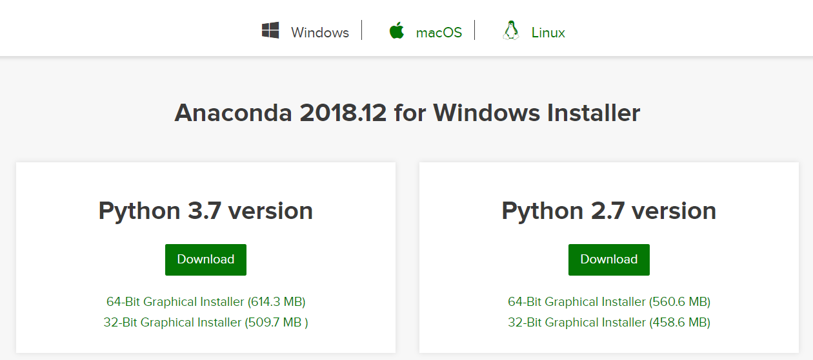
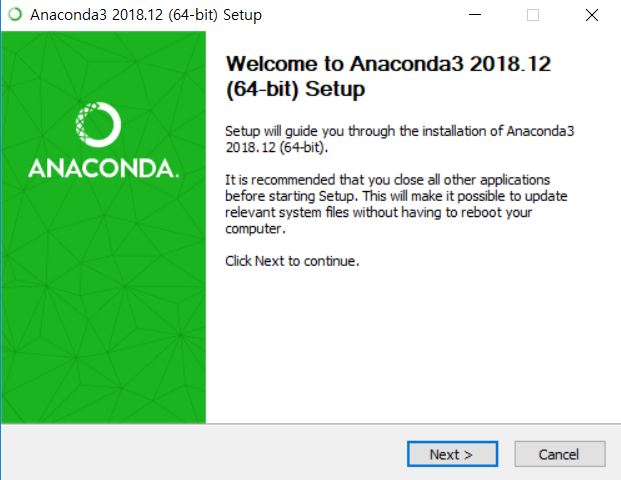
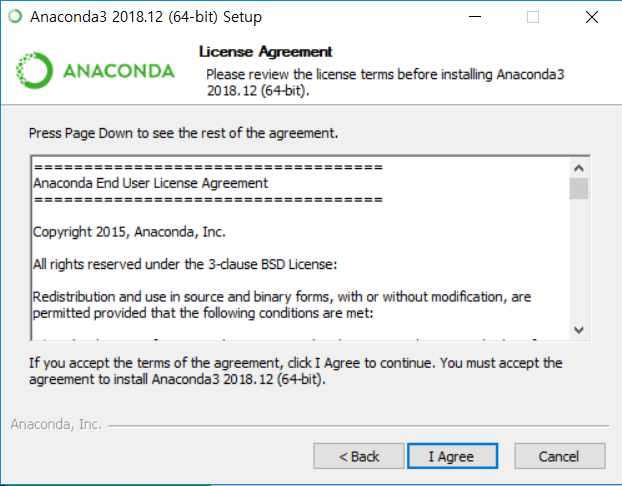
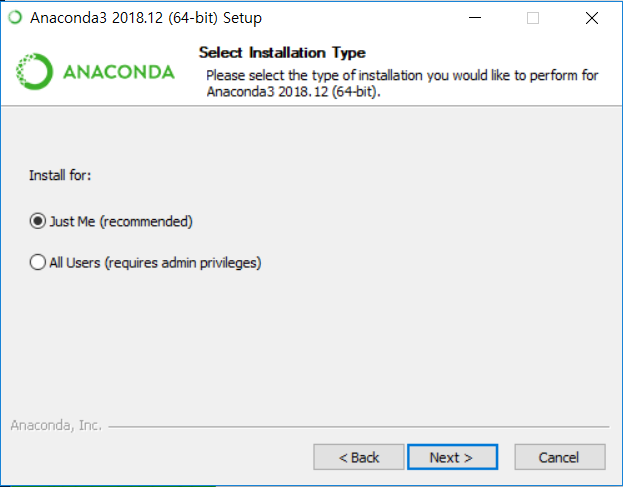
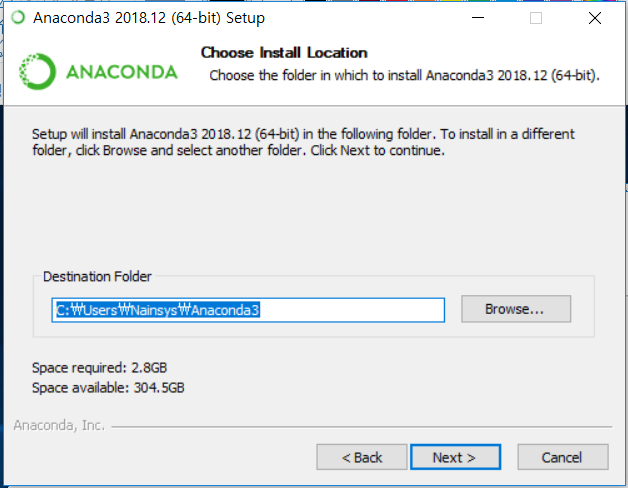
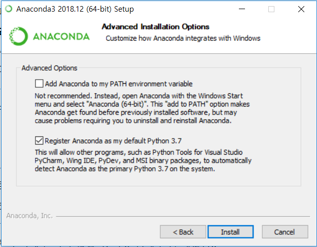
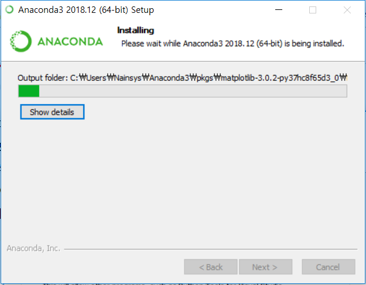
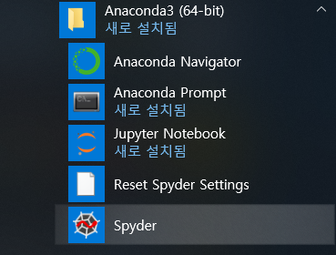
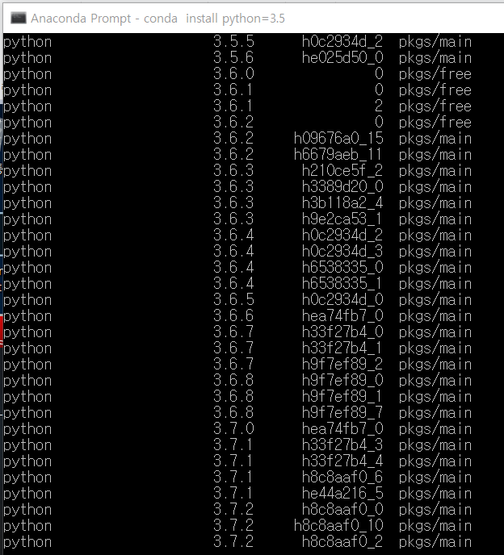

# 2.1.1. 	아나콘다 설치 \(파이썬 설치\)


  
아나콘다를 설치하면 numpy, scipy, sklearn 등 많은 라이브러리, 모듈, 유틸리티들이 함께 설치됩니다. 아나콘다를 설치하기 위해서는 먼저 아나콘다를 다운로드 해야 합니다.

이제 AVX를 지원하는 64비트 컴퓨터가 준비되었다고 가정하고 아나콘다의 파이썬 3.7 버전 64비트 인스톨러를 다운받습니다. 다음의 주소에서 ‘Python 3.7 version, 64-Bit Graphical Installer’를 다운로드 한 후 설치합니다.





아나콘다 설치 위치는 “C:\Users\&lt;사용자 계정&gt;Anaconda3” 로 해야 합니다. 이렇게 하지 않으면  파이참에서 아나콘다의 위치를 찾지 못하는 경우가 생기기 때문입니다.











마이크로 소프트의 Visual Studio Code는 가벼운 에디터이자 개발환경입니다. 설치 후 python extension 등 필요한 extension을 인스톨하여 그 기능을 확장하는 형태로 사용합니다. 파이참을 사용할 예정이라면 설치하지 않고 넘어 가도 됩니다.



설치가 완료되면 Anaconda Prompt에서 명령행 인터페이스를 사용해서 진행하면 됩니다.

아나콘다 프로그램 폴더중에서 Anaconda Prompt를 선택하여 실행합니다.



아나콘다가 설치되면 제일 먼저 설치된 파이썬의 버전을 확인해 봅니다. 

Anaconda Prompt를 선택하여 실행한 후 “conda search python”을 입력해 봅니다. 기본적으로 Python 2.6.8부터 2019년 2월까지의 최신버전인 3.7.2까지 설치되어 있습니다.

```text
(base)C:\Users\사용자계정명>conda search python
```



현재 \(base\) 환경에서 사용중인 파이썬 버전을 확인하려면 다음 명령을 실행합니다.

```text
(base) C:\Users\사용자계정>python --version
```

PIP는 Python Package Index \(PyPI\) 저장소로부터 패키지를 다운받아 설치 및 관리해주는 패키지 매니저 입니다. pip install \[패키지 이름\]의 형태로 패키지를 설치하면 됩니다.

Pip를 최신 버전으로 업그레이드 하려면 다음 명령을 실행합니다.

```text
(base) C:\Users\사용자계정>python –m pip install –-upgrade pip  
```


