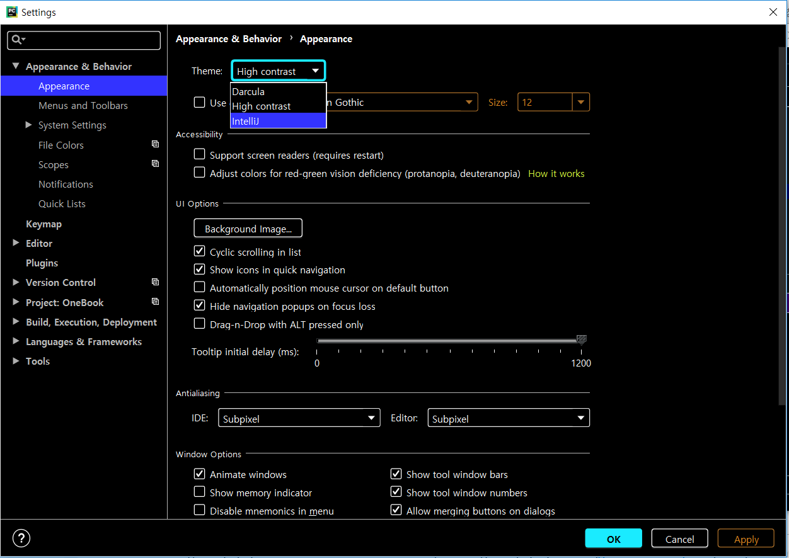

# 2\)    파이참 환경 설정


  
파이참의 File --&gt; Settings 를 선택하면 파이참의 기본 설정을 할 수 있습니다.

대부분은 그대로 사용해도 무방하지만 대표적인 설정 몇 가지만 소개합니다.

Appearance and Behavior ==&gt; Appearance

-       Theme: 파이참 화면 테마를 변경 할 수 있습니다. 흰 바탕을 원한다면 ‘IntelliJ’를 선택하면 됩니다.

-       폰트를 변경 할 수 있습니다.

-       Antialiasing: 텍스트를 부드럽게 하고 더 자세하게 렌더링 할 수 있습니다.

Keymap: 단축키들을 설정 합니다.

Editor ==&gt; General ==&gt; Highlight on Caret Movement : 열고 닫는 괄호의 강조

나머지 설정들은 다음 링크의 Jetbrains 도움말 파일들을 참조하면 됩니다.

[https://www.jetbrains.com/help/pycharm/settings-preferences-dialog.html](https://www.jetbrains.com/help/pycharm/settings-preferences-dialog.html)

기타 파이참을 사용할 때 유용한 단축키 및 기능 몇 가지 소개합니다.

F3 : 변수 또는 함수 tracking

Alt + Shift + R : 함수, 파일\(모듈\), 변수명 한꺼번에 변환하기.

Alt + Shift + X : 해당 코드 실행

Ctrl + G : 해당 변수, 파일, 함수가 사용된 코드 찾기.

Ctrl + L : 특정 번호의 Line으로 이동하기.

Ctrl + H : 프로젝트 전체를 대상으로 특정 문자열 검색 혹은 변환하기.

Shift 두번 : 프로젝트 전체에서 자신이 작업하고 싶은 파일 검색하여 열기. \(Search Everywhere\)

Ctrl + F : 현재 작업중인 파일 안에서 특정 문자열 검색 혹은 변환하기.

Ctrl + Shift + F : 현재 커서가 놓여있는 파일의 코드 indentation 을 자동으로 정렬합니다. \(자동 코드 정리\)

Ctrl + Alt + U : 어떤 변수 위에 커서를 두고 누르면 해당 변수의 Dependency 를 한눈에 볼 수 있는 Class Diagram 을 표시합니다.

변수 및 함수 선언부 보여주기: 파이참에서 가장 유용하고 많이 사용하는 기능 중 하나는 변수 및 함수 선언부로 들어가기 기능입니다. 이 기능은 특히 여러 모듈 구조를 파악하는데 사용됩니다. Ctrl 단축키를 누른 채로 특정 함수 및 변수를 클릭하면 해당 변수 및 함수의 선언부로 이동하게 됩니다.

다음 링크에서 한 페이지로 정리된 단축키들을 확인 할 수 있습니다.

[https://resources.jetbrains.com/storage/products/pycharm/docs/PyCharm\_ReferenceCard.pdf](https://resources.jetbrains.com/storage/products/pycharm/docs/PyCharm_ReferenceCard.pdf)

