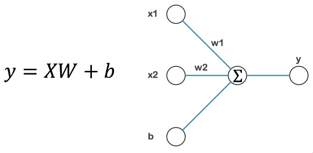
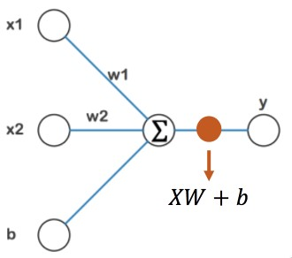
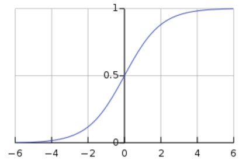

# 5.3.3.     기본 동작 실습

텐서플로우의 동작을 더욱 잘 이해하기 위해 간단한 예제부터 시작해 보겠습니다.

**1\)    Hello World**

TensorFlow를 사용하여 "hello TensorFlow!"를 인쇄하는 방법을 배우는 아주 간단한 예제입니다.

```python
import tensorflow as tf

#상수 op 를 생성 합니다. 생성된 op는 Default 그래프에 노드로 추가 됩니다.
 hello = tf.constant('Hello, TensorFlow!')
#tf 세션을 시작하고 op를 실행 합니다.
 sess = tf.Session()
 print(sess.run(hello))
```

이전 세션에서 TensorFlow 프로그램은 크게 두 가지 단계로 구성되어 있다고 설명 했습니다 ****. 구성 단계 4행에서 graph를 조립하고, 실행 단계 7행에서 session을 이용해 graph의 연산을 실행하였습니다. 개념 이해가 되시나요?


**2\)    Basic Operations**

다음은 TensorFlow 기본 연산 작업을 다루는 간단한 예제입니다. 파이썬 API 입장에서 Tensor는 메모리를 할당하거나 어떤 값을 가지고 있지 않으며 계산 그래프의 연산\(Operation\) 노드\(Node\)를 가리키는 객체에 가깝습니다. 이번 예제를 통해 이러한 개념을 이해해야 합니다. 플레이스홀더는 Placeholder 연산 노드를 가리키는 텐서이며 텐서플로우에서 그래프를 실행할 때 사용자가 임의의 데이터를 입력할 수 있는 통로가 됩니다.

```python
import tensorflow as tf

 # 기본 상수 operations
 # a에는 상수 2 b에는 상수 3이 대입됩니다.
 a = tf.constant(2)
 b = tf.constant(3)

 # default graph를 동작시킨다. A+b, a*b 결과를 출력합니다.
 with tf.Session() as sess:
     print("a=2, b=3")
     print("Addition with constants: %i" % sess.run(a+b))
     print("Multiplication with constants: %i" % sess.run(a*b))

 # 그래프의 입력으로 변수 op를 사용하는 예제, 세션을 실행 할 때 입력을 정의
 a = tf.placeholder(tf.int16)
 b = tf.placeholder(tf.int16)

 # 두가지 operations을 정의
 add = tf.add(a, b)
 mul = tf.multiply(a, b)

 # default graph를 동작 시킨다.
 with tf.Session() as sess:
     # 모든 operation은 변수 입력으로 실행 된다
     print("Addition with variables: %i" % sess.run(add, feed_dict={a: 5, b: 3}))
     print("Multiplication with variables: %i" % sess.run(mul, feed_dict={a:5, b:3}))
```

**3\)    TensorFlow Eager execution**

TensorFlow Eager execution은 TensorFlow를 대화형 명령 스타일로 프로그래밍 할 수 있도록 해주는 것입니다. Eager execution을 통해 TensorFlow를 보다 쉽게 시작할 수 있으며 개발을 보다 직관적으로 할 수 있습니다. Eager Execution에서 텐서는 데이터를 직접 포인팅합니다. 그래서 tf.Session을 시작하지 않고 직접 값을 얻을 수 있습니다. 좀더 자세히 소개하자면 텐서플로우의 Eager execution은 기존 그래프 기반 방식에서 벗어나 그래프 생성 없이 연산을 즉시 실행하는 명령형 프로그래밍 환경을 뜻합니다.

각 연산들은 나중에 실행할 계산 그래프를 만드는 것이 아니라, 실제 값이 반환됩니다. 이를 통해 텐서플로우를 좀더 쉽게 시작할 수 있고, 모델을 디버그 할 수 있으며 불필요한 상용구도 줄여줍니다.

다음 예제를 실행해 봅시다.

```python
import tensorflow as tf
import tensorflow.contrib.eager as tfe

tfe.enable_eager_execution()
c = tf.constant(1)

print(c)
print(c.numpy())
print(type(c))
print(type(c.numpy()))
```

2행에서 Eager execution을 선언하였고 4행에서 실행하였습니다. 결과에서 텐서 c를 확인해 보면 numpy 속성이 생긴 것을 알 수 있습니다. Eager Execution은 한번 설정하면 취소할 수 없어서 파이썬 세션을 새로 시작해야 합니다.

```text
tf.Tensor(1, shape=(), dtype=int32)
1
<class 'EagerTensor'>
<class 'numpy.int32'>
```

다음 예제로 Eager execution을  한번더 실습하여봅시다.

```python
import numpy as np
import tensorflow as tf
import tensorflow.contrib.eager as tfe

# Set Eager API
print("Setting Eager mode...")
tfe.enable_eager_execution()

# Define constant tensors
print("Define constant tensors")
a = tf.constant(2)
print("a = %i" % a)
b = tf.constant(3)
print("b = %i" % b)

# Run the operation without the need for tf.Session
print("Running operations, without tf.Session")
c = a + b
print("a + b = %i" % c)
d = a * b
print("a * b = %i" % d)

# Full compatibility with Numpy
print("Mixing operations with Tensors and Numpy Arrays")

# Define constant tensors
a = tf.constant([[2., 1.],
                  [1., 0.]], dtype=tf.float32)
print("Tensor:\n a = %s" % a)
b = np.array([[3., 0.],
               [5., 1.]], dtype=np.float32)
print("NumpyArray:\n b = %s" % b)

# Run the operation without the need for tf.Session
print("Running operations, without tf.Session")

c = a + b
print("a + b = %s" % c)

d = tf.matmul(a, b)
print("a * b = %s" % d)

print("Iterate through Tensor 'a':")
for i in range(a.shape[0]):
    for j in range(a.shape[1]):
        print(a[i][j])
```

```text
b = 3
Running operations, without tf.Session
a + b = 5
a * b = 6
Mixing operations with Tensors and Numpy Arrays
Tensor:
 a = tf.Tensor(
[[2. 1.]
 [1. 0.]], shape=(2, 2), dtype=float32)
NumpyArray:
 b = [[3. 0.]
 [5. 1.]]
Running operations, without tf.Session
a + b = tf.Tensor(
[[5. 1.]
 [6. 1.]], shape=(2, 2), dtype=float32)
a * b = tf.Tensor(
[[11.  1.]
 [ 3.  0.]], shape=(2, 2), dtype=float32)
Iterate through Tensor 'a':
tf.Tensor(2.0, shape=(), dtype=float32)
tf.Tensor(1.0, shape=(), dtype=float32)
tf.Tensor(1.0, shape=(), dtype=float32)
tf.Tensor(0.0, shape=(), dtype=float32)
```

**4\)    기본 분석 예제**

텐서플로우를 사용하여 AND 학습 연산을 하는 간단한 예제를 풀어 보려 합니다.


W라는 가중치와 b라는 바이어스를 텐서플로우 학습을 통해 찾는 것이 본 예제의 목적입니다.  



x1, x2로 입력이 두 개라서 가중치도 w1, w2 두개인데, 이를 행렬로 표현하면 2\*1의 크기를 가지는 행렬이 됩니다.일단 tensorflow를 import 하고 시작해야 합니다.

```python
import tensorflow as tf
import numpy as np
tf.set_random_seed(777)
x_data = np.array([[0, 0],
                  [0, 1],
                  [1, 0],
                  [1, 1]], dtype=np.float32)
y_data = np.array([[0],
                  [0],
                  [0],
                  [1]], dtype=np.float32)
```

그리고 위의 표를 numpy array로 선언해 둡니다.

```python
X = tf.placeholder(tf.float32, [None, 2], name='x-input')
Y = tf.placeholder(tf.float32, [None, 1], name='y-input')
```

그리고 위의 코드 처럼 입력\(X\)과 출력\(Y\)을 선언합니다. 여기서 **placeholde**는 텐서 객체처럼 행동하지만, 생성될 때 값을 가지지 않고, 자리\(place\)를 유지\(hold\)하는 개념입니다.

```python
W = tf.Variable(tf.random_normal([2, 1]), name='weight')
b = tf.Variable(tf.random_normal([1]), name='bias')
hypothesis = tf.sigmoid(tf.matmul(X, W) + b)
```

그리고 우리가 찾아야하는 가중치\(W\)와 바이어스\(b\)를 찾아야하니 변수\(Variable\)로 선언해 둡니다. 그리고 가설\(hypothesis\)이라고 하는데 loss function이라고 생각해도 됩니다. 위에서 이야기한데로 **XW+b**로 설정하고 활성화 함수 Activation Function이라는 것으로 Sigmoid 함수를 사용했습니다.



위 그림에 표시된 부분까지가 XW+b라면, 그 다음 출력 y로 넘어가는 단계에서 비선형성을 부여하기 위해 Activation Function을 사용해야 합니다. 그 활성화 함수에 사용하는 것 중 하나가 Sigmoid입니다. Sigmoid함수는 최대 1, 최소 0의 값을 가지는 함수입니다.



```python
# cost/loss function
cost = -tf.reduce_mean(Y * tf.log(hypothesis) + (1 - Y) * tf.log(1 - hypothesis))
train = tf.train.GradientDescentOptimizer(learning_rate=0.1).minimize(cost)
```

이렇게 cost 함수를 cross-entropy로 잡고, cost를 최소화하는 optimizer로 Gradient Descent를 사용합니다.

```python
# Accuracy computation
# True if hypothesis>0.5 else False
predicted = tf.cast(hypothesis > 0.5, dtype=tf.float32)
accuracy = tf.reduce_mean(tf.cast(tf.equal(predicted, Y), dtype=tf.float32))
```

이제 예측 결과를 계산하는 부분과 정확도\(accuracy\)를 계산하는 부분입니다. sigmoid 함수의 결과가 0과 1사이의 값이니 0.5를 넘으면 1로 보는거죠. 그리고 참값\(Y\)과 비교해서 평균을 잡아서 그걸 accuracy로 보는 겁니다.

```python
# Launch graph
with tf.Session() as sess:
    # Initialize TensorFlow variables
    sess.run(tf.global_variables_initializer())
    for step in range(10001):
        sess.run(train, feed_dict={X: x_data, Y: y_data})
        if step % 100 == 0:
            print(step, sess.run(cost, feed_dict={X: x_data, Y: y_data}), sess.run(W))
    # Accuracy report
    h, c, a = sess.run([hypothesis, predicted, accuracy], feed_dict={X: x_data, Y: y_data})
    print("\nHypothesis: ", h, "\nCorrect: ", c, "\nAccuracy: ", a)
```

이제... 그래프\(graph\)를 시작합니다. 텐서플로우에서 학습하기 위해 진행하는 과정을 graph라고 합니다. **`tf.global_variables_initializer()`**를 통해 반드시 초기화해야합니다. 그리고 10000번 반복하는 **`for`**문에서 **`sess.run`**으로 훈련\(train\)을 실행합니다. 마지막에 훈련이 끝나고 나면 accuracy를 확인합니다.

방금의 과정은

1. 학습 데이터와 출력 데이터를 읽음
2. 입출력값과 학습할 뉴럴 네트워크의 가중치와 바이어스를 정의함
3. 학습할 네트워크를 정의하고 가설\(hypothesis 모델\)을 정의함
4. cost함수와 훈련\(train\)에 사용할 optimizer를 결정함
5. 예측값과 accuracy를 정의함
6. 학습 시작 Session.run
7.  Accuracy 확인

으로 진행되었습니다. 그 결과는 

```text
Hypothesis:  [[1.2380394e-05]
 [2.0202760e-02]
 [2.0202760e-02]
 [9.7170401e-01]]
Correct:  [[0.]
 [0.]
 [0.]
 [1.]]
Accuracy:  1.0
```

와 같이 나타납니다. 정확도는 1로 잘 나왔습니다. 우리가 학습하려 한 **AND**인 **0, 0, 0, 1**을 잘 학습한 것 같습니다. 간단한 예제이지만, 텐서플로우라는 라이브러리를 어떻게 사용하는지 튜토리얼처럼 한 번 시작해 보았습니다.

전 코드를 다시 보여 드리면 다음과 같습니다.

```python
import tensorflow as tf
import numpy as np
tf.set_random_seed(777)
x_data = np.array([[0, 0],
                  [0, 1],
                  [1, 0],
                  [1, 1]], dtype=np.float32)
y_data = np.array([[0],
                  [0],
                  [0],
                  [1]], dtype=np.float32)

X = tf.placeholder(tf.float32, [None, 2], name='x-input')
Y = tf.placeholder(tf.float32, [None, 1], name='y-input')

W = tf.Variable(tf.random_normal([2, 1]), name='weight')
b = tf.Variable(tf.random_normal([1]), name='bias')
hypothesis = tf.sigmoid(tf.matmul(X, W) + b)

# cost/loss function
cost = -tf.reduce_mean(Y * tf.log(hypothesis) + (1 - Y) * tf.log(1 - hypothesis))
train = tf.train.GradientDescentOptimizer(learning_rate=0.1).minimize(cost)

# Accuracy computation
# True if hypothesis>0.5 else False
predicted = tf.cast(hypothesis > 0.5, dtype=tf.float32)
accuracy = tf.reduce_mean(tf.cast(tf.equal(predicted, Y), dtype=tf.float32))

# Launch graph
with tf.Session() as sess:
    # Initialize TensorFlow variables
    sess.run(tf.global_variables_initializer())
    for step in range(10001):
        sess.run(train, feed_dict={X: x_data, Y: y_data})
        if step % 100 == 0:
            print(step, sess.run(cost, feed_dict={X: x_data, Y: y_data}), sess.run(W))
    # Accuracy report
    h, c, a = sess.run([hypothesis, predicted, accuracy], feed_dict={X: x_data, Y: y_data})
    print("\nHypothesis: ", h, "\nCorrect: ", c, "\nAccuracy: ", a)
```

제 컴퓨터에서 위의 코드를 테스트해보니 너무 많은 시간이 소요됩니다. 성능 좋은 GPU 컴퓨터가 간절한 상황입니다.

