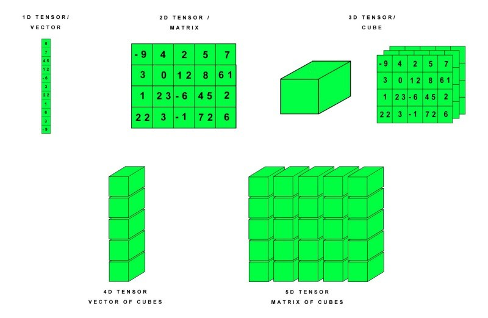
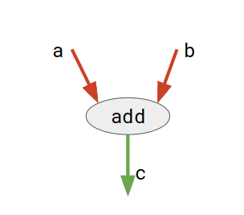

# 5.3.	Tensorflow를 사용한 학습

통계 및 다양한 수학 알고리즘을 공부해야 하는 머신러닝은 매우 복잡해 보이지만 TensorFlow와 같은 많은 오픈 소스 패키지가 생겨나고 발전함에 따라 머신러닝 모델을 구축하는 어려운 작업은 이전보다 훨씬 쉬워졌습니다.

텐서플로우\(TensorFlow\)는 기계 학습과 딥러닝을 위해 구글에서 만든 오픈소스 라이브러리입니다.

TensorFlow는 데이터의 기본 단위로 취급할 수 있는 Tensors 개념을 사용합니다. 텐서는 다차원 배열을 통해 표현할 수있는 N 차원 벡터로 정의할 수 있습니다.

TensorFlow는 데이터 플로우 그래프\(Data Flow Graph\) 방식을 사용합니다.

데이터 플로우 그래프란 수학 계산과 데이터의 흐름을 노드\(Node\)와 엣지\(Edge\)를 사용한 방향 그래프\(Directed Graph\) 표현입니다.

Tensor란 많은 데이터를 효과적으로 처리하는 자료구조를 말하며 다차원 array, list라고 생각하면 됩니다. Flow란 결국 Graph를 말합니다. 즉 모든 계산을 쉽게 하기 위해서 각각의 연산을 잘게 쪼개고 이것을 Graph로 연결한 것입니다.

일단 텐서플로우에서 사용하는 기본 용어부터 살펴보겠습니다.

* **오퍼레이션\(Operation\)**

  그래프 상의 노드는 오퍼레이션\(줄임말 _op_\)으로 불립니다. 오퍼레이션은 하나 이상의 _텐서_를 받을 수 있습니다. 오퍼레이션은 계산을 수행하고, 결과를 하나 이상의 텐서로 반환할 수 있습니다. 즉 Operation\(op\)란 동작을 정의한 것입니다.

* **텐서\(Tensor\)**

  내부적으로 모든 데이터는 텐서를 통해 표현됩니다. 텐서는 일종의 다차원 배열인데, 그래프 내의 오퍼레이션 간에는 텐서만이 전달됩니다

* **세션\(Session\)**

  그래프를 실행하기 위해서는 세션 객체가 필요합니다. 세션은 오퍼레이션의 실행 환경을 캡슐화한 것입니다.

* **변수\(Variables\)**

  변수는 그래프의 실행시, 패러미터를 저장하고 갱신하는데 사용됩니다. 메모리 상에서 텐서를 저장하는 버퍼 역할을 합니다.

Node란 수학적 op의 그래프 표현입니다. Edge란 Node와 Node를 연결한 것을 말하는데, 그래프의에서 에지는 그들 사이에서 전달되는 다차원 데이터 배열 \(텐서라고 함\)을 나타냅니다.

TensorFlow에서는 텐서가 데이터의 중심 단위 임에 유의해야 합니다.

아래 주어진 그림으로 이러한 관계를 설명해 보겠습니다.

여기서, add는 덧셈 연산을 나타내는 노드입니다.  a와 b는 입력 텐서이고 c는 결과 텐서입니다.

이런 유연한 아키텍처를 통해 하나의 API로 데스크톱, 서버 또는 모바일 장치의 하나 이상의 CPU 또는 GPU에 계산을 배포할 수 있습니다. TensorFlow는 여러 API \(Application Programming Interfaces\)를 제공합니다. 이들은 크게 두 가지 범주로 나눌 수 있습니다.

**Low level API:**

* 완벽한 프로그래밍 제어
* 기계 학습 연구자에게 권장
* 모델을 정밀하게 제어 할 수 있습니다.
* TensorFlow Core는 TensorFlow의 저수준 API입니다.

**High level API:**

* TensorFlow 코어 위에 구축
* TensorFlow Core보다 배우고 사용하기 쉽습니다.
* 반복적 인 작업을 다른 사용자간에보다 쉽고 일관되게 만들기
* tf.contrib.learn은 상위 레벨 API의 예입니다.

TensorFlow는 계산\(computation\)을 그래프\(graph\)로 표현하는 프로그래밍 시스템입니다. 그래프의 노드\(node\)는 연산\(op, operations의 줄임\)이라고 부릅니다. 하나의 연산은 0개 이상의 Tensor를 취해 어떤 계산을 한 뒤 0개 이상의 Tensor를 다시 반환합니다. Tensor는 형태를 가진 다차원 배열이라고 할 수 있습니다.

TensorFlow에서 그래프는 계산을 기술한 것입니다. 어떤 것이든 계산하기 위해서는 반드시 그래프를 Session에 올려야 합니다. Session은 CPU나 GPU 같은 Devices에 그래프 연산을 올린 뒤 연산을 실행할 수 있는 메소드를 제공합니다. 이 메소드는 연산에 의해 생성된 텐서를 반환하는데, 이 텐서의 형태는 파이썬에서는 numpy의 ndarray 객체, C와 C++에서는 tensor flow::Tensor 개체입니다.

