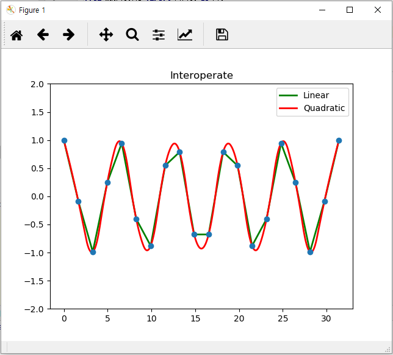

# 4.3.1. 	Interpolation

보간법\(interpolation\)이란 표본데이터가 주어졌을 때 각 점들의 중간 값\(사이값\)을 구하면, 표본 데이터가 아닌 영역에서 데이터가 어떻게 될지 예상하는데 도움이 됩니다. 즉 discrete한 sample들을 바탕으로 우리가 가지고 있지 않는 점의 값을 추정하는 방법입니다.

사인\(sine\) 함수에 가까운 실험 데이터를 생각해 보겠습니다. 다음 예제는 NumPy, Matplotlib, SciPy를 종합적으로 사용합니다.

```python
 import numpy as np
 from scipy.interpolate import interp1d
 from matplotlib import pyplot as plt

 # Cosine 함수를 0부터 10pi까지 20개 만든다.
 x = np.linspace(0,10*np.pi, 20)
 y = np.cos(x)

 #interoperate 함수로 보간법을 적용하여 linear(선형보정) quadratic(부드러운 보정) 두가지 방법으로 만든다
 fl = interp1d(x,y,kind = 'linear')
 fq = interp1d(x,y,kind = 'quadratic')

 xint = np.linspace(x.min(), x.max(), 1000)
 yintl = fl(xint)
 yintq = fq(xint)

 # Plot the data and the interpolation
 plt.plot(xint, yintl, color = 'green', linewidth=2)
 plt.plot(xint, yintq, color = 'red', linewidth=2)
 plt.legend(['Linear','Quadratic'])
 plt.plot(x,y,'o')    #값의 위치를 점으로 표현
 plt.ylim(-2,2)

 plt.title('Interoperate')
 plt.show()
```

위의 코드를 실행하면 다음과 같은 그래프가 출력 됩니다.



